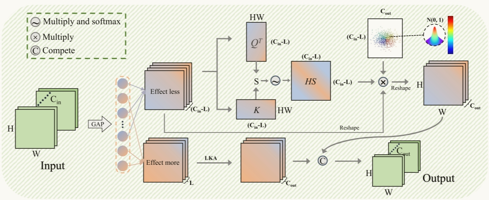
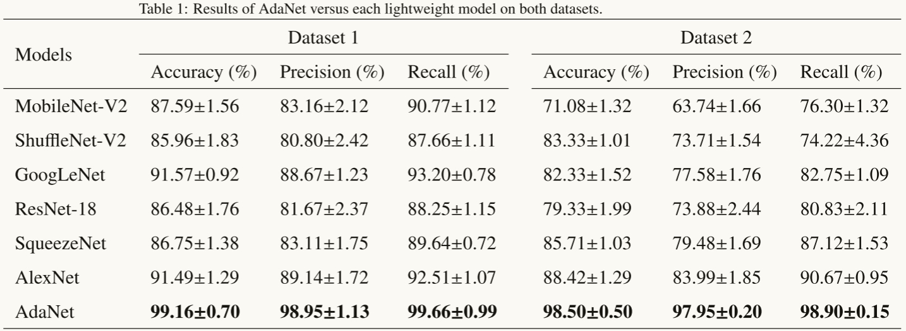

# AdaNet (Pattern Recognition)
Codes for paper "AdaNet: A Competitive Adaptive Convolutional Neural Network for Spectral Information Identification".
Unsupervised detection of anomaly points in time series is a challenging problem, which requires the model to learn informative representation and derive a distinguishable criterion. In this paper, we propose the Anomaly Transformer in these three folds:

- AdaConv based on competition idea is proposed to reduce redundant spectral features.
- Self-attention mask is designed to mitigate the loss of convolution.
- AdaNet is proposed for spectral information identification.

<p align="center">

</p>

## Get Started

1. Install Python 3.6, PyTorch >= 1.4.0. 
( The required environment versions will be updated shortly.)
2. Download data. Due to corporate confidentiality agreements and other reasons, the data used are currently not available to the public. Should you have a need for it, please contact us via email at (shiyan@neepu.edu.cn). **All the datasets are well pre-processed**. 
3. We will provide comprehensive training and testing scripts, including multiple sets of learning rate configurations, annealing algorithms, and select hyperparameters, upon the formal acceptance of our paper.

"""
If you have questions about this, please email us for (1106860376@qq.com) or  (shiyan@neepu.edu.cn).
"""

## Main Result

To more prominently demonstrate the potential of the method in this paper, we compare the performance of AdaNet with some common CNNs. Because the spectral information obtained from hyperspectral systems has the advantages of good reproducibility, stability and high detection accuracy, the sample amount is small. If the model has too many parameters, it will increase the risk of overfitting, while increasing the time cost of training and inference. To avoid this problem, AdaNet combined the design idea of lightweighting, while choosing relativelylightweight models (MobileNet-V2, ShuffleNet-V2, GoogLeNet, ResNet-18, SqueezeNet, AlexNet) were compared. **Generally,  AdaNet achieves SOTA.**

<p align="center">

</p>

## Citation
If you find this repo useful, please cite our paper. 

```
@article{
ziyang li,
title={AdaNet: A Competitive Adaptive Convolutional Neural Network for Spectral Information Identification},
author={Ziyang Li, Yang Yu, Chongbo Yin, Yan Shi},
journal={Pattern Recognition},
year={2022},
url={××××××××××××××××}
}
```

## Contact
If you have any question, please contact (1106860376@qq.com) or  (shiyan@neepu.edu.cn).
